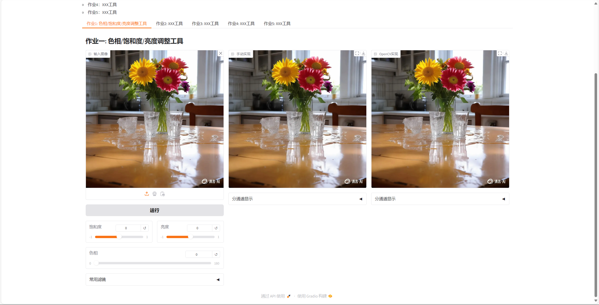
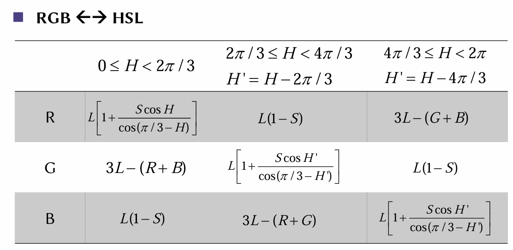
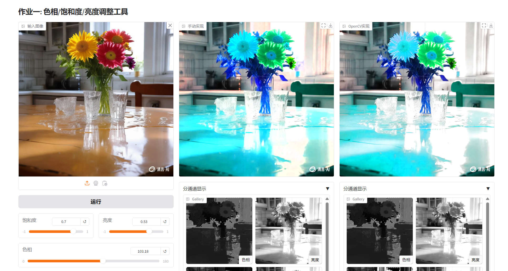
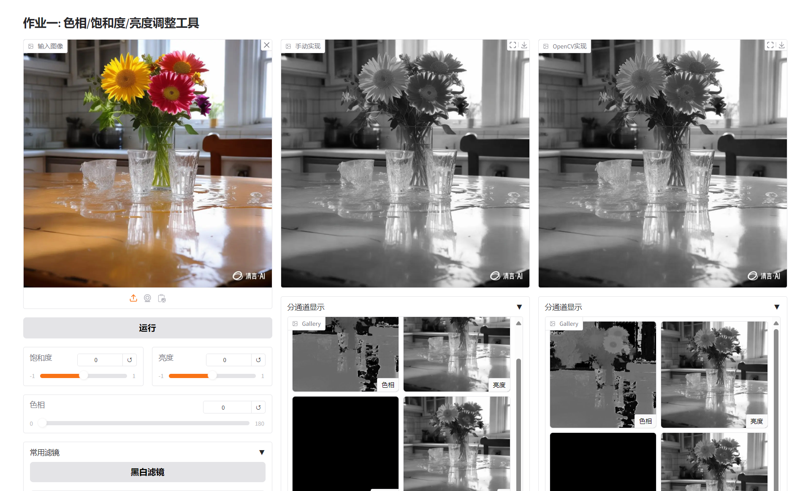
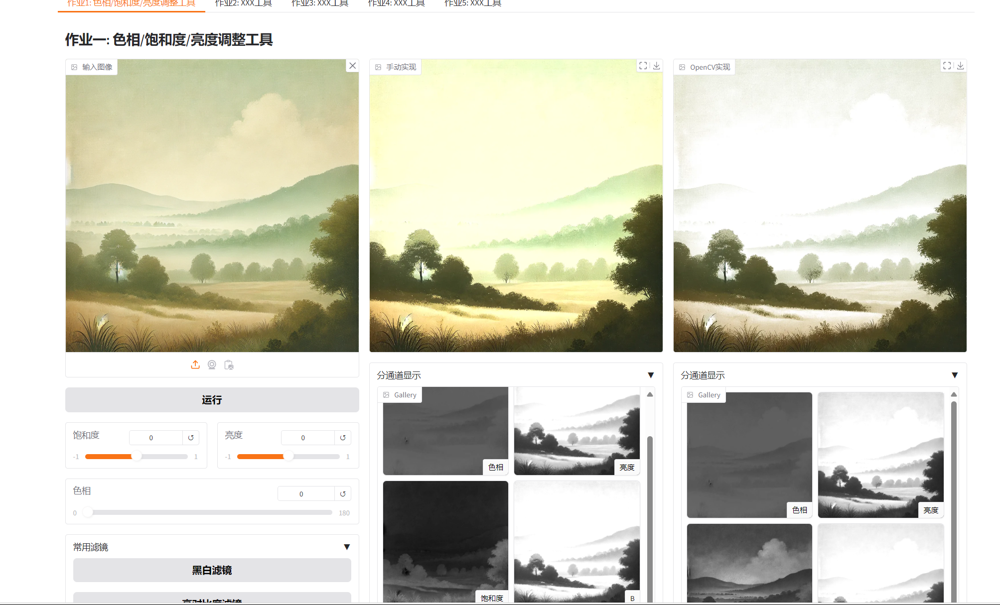

# 实现功能

- 调整图片的饱和度、亮度、色相
- 手动实现与`OpenCV`官方实现对比]
- 附加功能：
  - 显示图片各通道
  - 一键运用黑白滤镜和高对比度滤镜

# UI界面

UI界面主要分为三栏，最左边一栏是原图像与操作面板，中间和右边一栏分别是手动实现与`OpenCV`实现：



同时右边两栏还各有一个折叠菜单，可以显示图像的各个通道，包括HLS三个通道和RGB三个通道。

最左边一栏也有要一个折叠菜单，展开后可以应用常用滤镜，目前只实现了黑白滤镜和高对比度滤镜：


# 代码介绍

具体实现可以分为三个部分

1. RGB图像转HLS图像
2. 对HLS图像三个通道进行调整
3. HLS图像转回RGB图像

## bgr2hls()

大概的思路是，首先取出RGB三个通道，并将他们都归一化为0到1之间，然后按照以下公式计算HLS三个通道的值：
$$
L = \frac{R + G + B}{3} \\
S = 1 - \frac{3\min(R,G,B)}{R + G + B} \\
\theta = \arg \cos \frac{2 R - G - B}{2\sqrt{R^2 + G^2 + B^2 - RG - RB - GB}} \\
H = \begin{cases}
		theta, &B <= G \\
		2\pi - theta, &B > G
	\end{cases}
$$
需要注意的是，`OpenCV`中LS通道的取值范围为0到255，而H通道的取值范围为0到180。因此在最后还需要将HLS三个通道的值进行调整：

```python
H = H / (2*np.pi) * 180
L = np.clip(L*255, 0, 255)
S = np.clip(S*255, 0, 255)
```

另外，为避免出现精度问题，在最开始我将每个像素的值都转为了`np.float32`再进行计算。计算完成后，再将HLS三个通道的值转回`np.uint8`。

## hls2bgr()

在这部分，我采用的具体计算公式与课件中的基本一致：



需要注意的仍然是精度问题和值域问题。需要在计算开始前转为`np.float32`，并对L和S通道进行归一化处理，在计算完成后再转回`np.uint8`。另外，由于`opencv`中，H通道是将360度压缩到0到180之间进行储存，并且使用的是角度值，因此还需要转换为弧度制：
$$
H = \frac{H}{180}\cdot 2\pi
$$
在计算完成后，注意将RGB三个通道的值放大回0到255的范围：

```python
B = np.clip(B * 255, 0, 255)
G = np.clip(G * 255, 0, 255)
R = np.clip(R * 255, 0, 255)
rgb_image = np.stack([B, G, R], axis=-1)
```

## 调整三个通道

在UI界面中，有三个滑动条，分别表示H、L、和S通道的改变量。L和S通道的改变量是一个介于-1到1之间的数，而H通道的改变量则是一个介于0到180之间的数。

对于L和S通道，改变量表示增大的比例；对于H通道，改变量表示色相偏移的角度。因此具体的代码如下：

```python
hls_image[:,:,0] = (hls_image[:,:,0] + hue) % 180
hls_image[:,:,1] = np.clip(hls_image[:,:,1] * (1+lightness), 0, 255)
hls_image[:,:,2] = np.clip(hls_image[:,:,2] * (1+saturation), 0, 255)
```

同样地，为了避免出现精度问题，我在计算开始前和计算结束后对其进行了转换。

# 实验结果

经测试，基本实现了对色相、亮度、饱和度的调整功能：



手动实现和`OpenCV`官方实现稍有不同，对比分通道显示后推测是`hls2bgr()`函数与官方实现有差异。

一键运用滤镜的效果也可以接受，这是黑白滤镜的效果：



这是高对比度滤镜的效果：



这里就可以明显看出，手动实现与官方实现的效果还是有所不同。

# 代码与网站

代码已上传至github仓库https://github.com/shuitatata/24Fall-ImageProcessing.git

网站已部署至学校CLAB平台，可以在校园网环境下使用10.129.242.49:8088访问